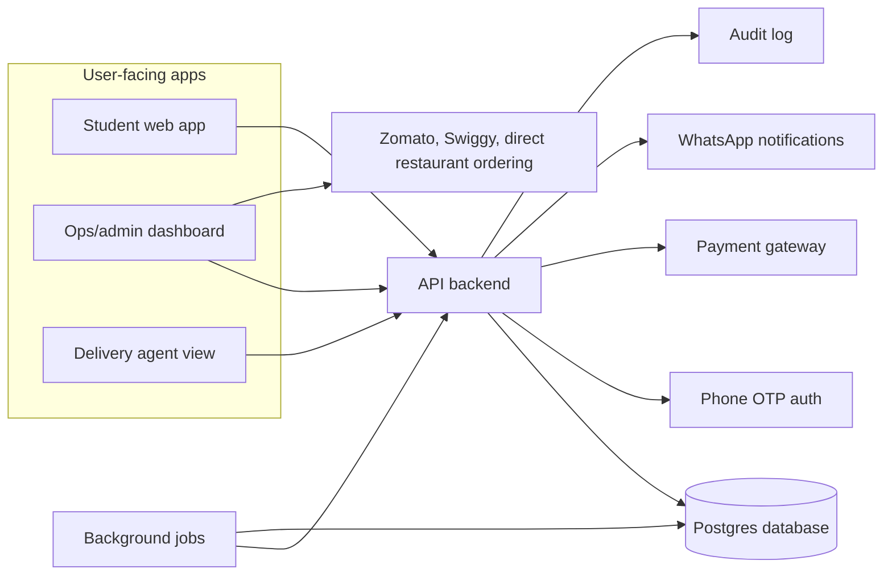
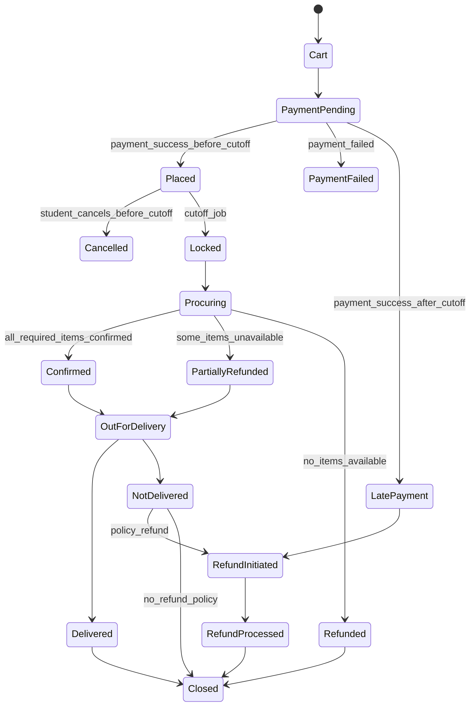
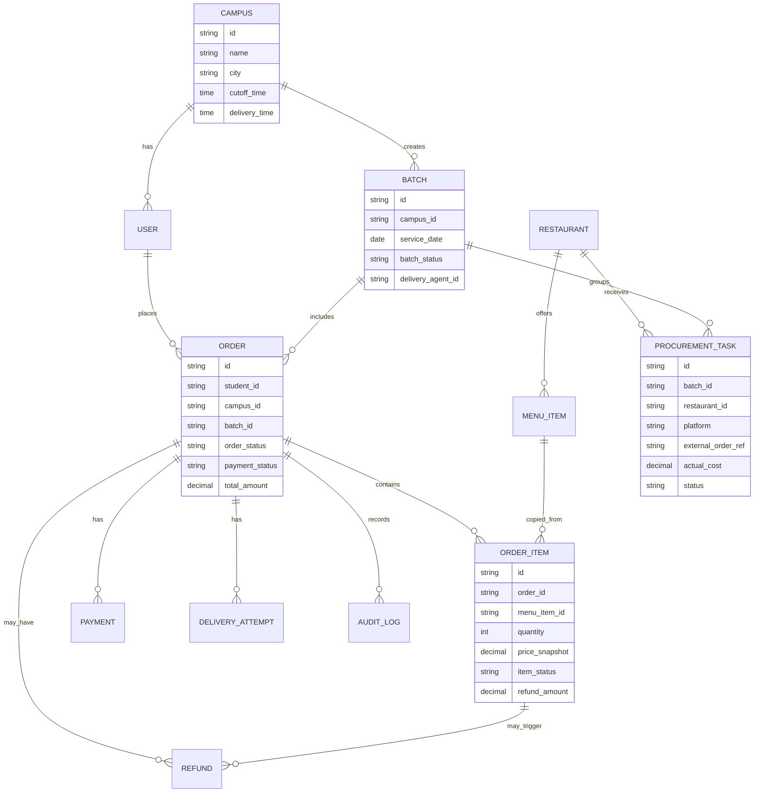

# Campus Food Delivery System Flow

## Purpose

This app is not a normal food delivery marketplace. It is a campus-focused batch procurement system:

- Students browse partner restaurants and place prepaid orders before a campus cutoff.
- Orders are locked into a campus-date batch after cutoff.
- Ops places the real orders on Zomato, Swiggy, or directly with restaurants.
- Unavailable items trigger automatic partial or full refunds.
- A delivery agent brings the consolidated batch to the campus drop point.

The hard part is not the menu UI. The hard part is clean handling of cutoff, batching, procurement, refunds, delivery proof, and support disputes.

## Recommended Product Principle

Let students browse first and log in later.

Good flow:

```text
Open app -> select campus -> browse/search -> add to cart -> checkout -> phone OTP -> pay -> placed
```

Avoid this:

```text
Open app -> forced login -> profile setup -> then show food
```

The first version creates less friction and still captures identity before payment.

## 1. System Architecture



### Explanation

The API backend is the source of truth for orders, batches, payments, refunds, and notifications. Ops can use external ordering platforms manually, but every decision must be recorded back into the admin dashboard.

Do not let Google Sheets, WhatsApp messages, or payment dashboard notes become the source of truth. They can support the workflow, but the app database should own final state.

## 2. Complete End-to-End Flow

```mermaid
flowchart TD
  subgraph StudentFlow["Student ordering flow"]
    A["Open app"] --> B["Select or confirm campus"]
    B --> C["Browse trending, offers, restaurants"]
    C --> D["Search restaurant or food item"]
    D --> E["Add items to cart"]
    E --> F["Review cart, cutoff, ETA, fees"]
    F --> G{"Logged in?"}
    G -- "No" --> H["Phone OTP login"]
    G -- "Yes" --> I["Use saved profile"]
    H --> J["Confirm name, campus, delivery point"]
    I --> J
    J --> K["Pay"]
  end

  K --> L["Payment initiated"]
  L --> M{"Payment webhook success before cutoff?"}
  M -- "No" --> N["Payment failed, pending, or late"]
  N --> O["Retry payment or auto-refund if deducted"]
  M -- "Yes" --> P["Create order and order items as PLACED"]
  P --> Q["Send placed notification"]

  subgraph CutoffBatch["Cutoff and batching"]
    Q --> R["Campus cutoff job runs"]
    R --> S["Create or reuse campus-date batch"]
    S --> T["Lock paid placed orders"]
    T --> U["Group order items by restaurant"]
    U --> V["Create procurement tasks"]
  end

  subgraph Procurement["Ops procurement flow"]
    V --> W["Ops sees batch grouped by restaurant"]
    W --> X["Place real order externally"]
    X --> Y["Enter external order ref and actual cost"]
    Y --> Z{"Item available?"}
    Z -- "Yes" --> AA["Mark order item confirmed"]
    Z -- "No" --> AB["Mark order item unavailable"]
    AB --> AC["Create refund task"]
    AA --> AD{"All items resolved?"}
    AC --> AD
  end

  subgraph Refunds["Refund flow"]
    AC --> AE["Initiate gateway refund"]
    AE --> AF{"Refund webhook processed?"}
    AF -- "Yes" --> AG["Mark refund processed and notify student"]
    AF -- "No" --> AH["Keep in refund pending queue"]
  end

  subgraph Delivery["Delivery flow"]
    AD -- "Yes" --> AI["Prepare campus batch for dispatch"]
    AI --> AJ["Assign delivery agent"]
    AJ --> AK["Out for delivery notification"]
    AK --> AL["Arrive at campus drop point"]
    AL --> AM{"Student receives?"}
    AM -- "Yes" --> AN["Mark delivered with OTP or agent confirmation"]
    AM -- "No" --> AO["Mark not delivered with reason"]
    AO --> AP{"Refund or no refund?"}
    AP -- "Refund" --> AC
    AP -- "No refund" --> AQ["Close with reason"]
    AN --> AR["Close order"]
    AG --> AR
  end
```



## 3. Student Flow In Detail

### Home

The first screen should show food immediately.

Recommended sections:

```text
Delivering to: Poornima University
Order before: 5:00 PM
Expected delivery: around 7:00 PM

Search restaurants or dishes
Best offers
Trending on campus
Featured restaurants
Reliable picks
Under Rs 199
```

### Restaurant and Item Ranking

Because there are 200 to 250 partner restaurants, ranking matters more than raw listing.

Use a score such as:

```text
ranking_score =
  campus_popularity
+ offer_score
+ commission_boost
+ manual_priority
+ availability_confidence
- refund_risk_penalty
```

This lets the business promote high-commission restaurants without damaging trust by pushing restaurants that frequently fail procurement.

### Search

Search should work for both restaurants and dishes.

Examples:

```text
burger
paneer roll
thali
Burger Farm
under 200
veg
```

For dish searches, show item cards as well as restaurant cards. Many students search by food craving, not restaurant brand.

### Cart

For MVP, use one restaurant per cart.

Multi-restaurant carts are possible later, but they make refunds, procurement, packaging, and delivery more complicated.

The cart should show:

```text
Restaurant
Items and quantities
Campus
Drop point
Cutoff time
Expected delivery time
Subtotal
Service or delivery fee
Total payable
Availability and refund note
```

Suggested cart note:

```text
Final restaurant availability is confirmed after cutoff. If an item is unavailable, refund starts automatically.
```

## 4. Cutoff And Batch Rules

At cutoff time, a background job should:

```text
Find campus whose cutoff has passed
Create or reuse today's batch
Find paid placed orders
Assign orders to the batch
Lock orders
Group items by restaurant
Create procurement tasks
Notify ops
Notify students
```

Important backend rules:

- Cutoff must be enforced server-side.
- A batch should be unique by campus and date.
- The cutoff job must be idempotent, meaning it can run twice without duplicating batches or orders.
- Orders paid after cutoff should not silently enter the batch.

Recommended MVP rule:

```text
Payment success before cutoff = accepted
Payment success after cutoff = late, auto-refund or manual review
```

## 5. Ops Procurement Flow

Ops should not see one long list of student orders. Ops should see restaurant-level work.

Example:

```text
Batch: Poornima University, Today
Total orders: 87
Restaurants: 23
Procurement pending: 23 restaurant tasks

Burger Farm
- 12 Classic Burgers
- 7 Fries
- 5 Cold Coffees
External order ref: required
Actual cost: required
Status: pending / placed / confirmed / issue
```

Each procurement task should store:

```text
batch_id
restaurant_id
platform
external_order_ref
actual_cost
placed_by
status
notes
receipt_or_screenshot_optional
```

## 6. Refund Flow

Students should not need to request a refund when an item is unavailable. If ops marks an item unavailable, the system should create the refund task automatically.

Rules:

```text
One unavailable item in a multi-item order -> partial refund
Only item unavailable -> full order refund
Delivered item issue -> support review
Student absent -> depends on business policy
```

Refund statuses should be separate from order statuses:

```text
refund_pending
refund_initiated
refund_processed
refund_failed
```

## 7. Delivery Flow

Delivery is batch-based, not restaurant-order-based.

Recommended flow:

```text
Batch ready
Assign delivery agent
Mark out for delivery
Send student notification
Arrive at campus/drop point
Verify handoff
Delivered or not delivered
Close order
```

Delivery proof options:

- Student OTP
- Pickup code
- Agent confirmation
- Optional photo proof for disputed deliveries

Do not close an order just because the batch reached campus. Close only after delivery or a documented not-delivered reason.

## 8. State Model



## 9. Data Model



## 10. Statuses To Keep Separate

Avoid one giant `order.status`.

Use separate status fields:

```text
order_status:
cart, placed, locked, procuring, confirmed, out_for_delivery, delivered, closed, cancelled

order_item_status:
pending, confirmed, unavailable, refunded

payment_status:
pending, success, failed, late, refunded, partially_refunded

batch_status:
open, locked, procuring, ready_for_dispatch, out_for_delivery, closed

refund_status:
pending, initiated, processed, failed

delivery_status:
not_started, assigned, out_for_delivery, arrived, delivered, not_delivered
```

This separation makes partial refunds and missed deliveries much easier to handle.

## 11. MVP Scope

Build this first:

1. Student browse and search
2. Campus selector
3. One-restaurant cart
4. Phone OTP login
5. Order placement
6. Cutoff lock
7. Batch view grouped by restaurant
8. Ops procurement task screen
9. Item unavailable marking
10. Manual refund queue
11. Delivery status update
12. Student order tracking page

Delay these until after MVP:

- Multi-restaurant cart
- Live delivery tracking
- Substitute item approval
- Advanced recommendation engine
- Full restaurant portal
- Dynamic pricing

## 12. Open Decisions

Before development, decide these:

```text
Can students cancel after payment but before cutoff?
What happens if payment succeeds after cutoff?
Is email required or optional?
Is one restaurant per order acceptable for MVP?
What is the refund policy for student absent at delivery?
Will high-commission restaurants be visibly marked as offers/promoted?
Which payment gateway has the best UPI success rate, refund reliability, and support?
```

## 13. Best Build Order

Recommended build sequence:

```text
1. Data model
2. Student browse/cart
3. OTP login
4. Order placement without payment automation
5. Cutoff locking and batch creation
6. Ops procurement dashboard
7. Unavailable item and refund queue
8. Payment gateway integration
9. WhatsApp notifications
10. Delivery agent flow
```

This order proves the operational system before investing too much in polish.